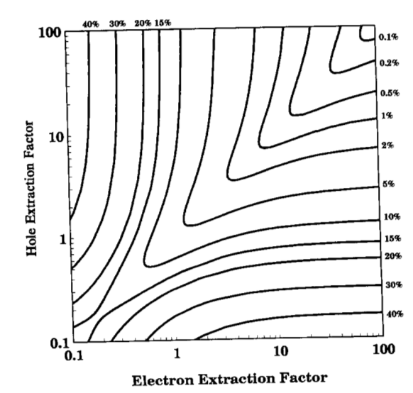

# ME701 - Homework 5

## Problem 1 - `str` and file processing - 1 point

Use only `str` functions to read `pwr.log` and produce two arrays, one
for `kinf` and one for `burnup`.  Note, these correspond to the second
and third full columns, i.e., `burnup = [0, 0.1, 0.5, ...]` and
`kinf = [1.27354, 1.23449, ...]` in the following:

```
                                             ****** *******
   NO VOID    TFU    TMO    TCO    BOR ROD   BURNUP   K-INF   K-INF     M2     PIN   U-235 FISS PU  TOT PU
                                             MWD/KG             TWO-GROUP     PEAK    WT %    WT %    WT %
    1  0.0  900.0  565.0  580.0  900.0        0.000 1.27354 1.27149  62.18   1.059   4.000   0.000   0.000  
    2                                         0.100 1.23449 1.23311  61.64   1.060   3.988   0.002   0.002  
    3                                         0.500 1.22571 1.22445  61.51   1.060   3.941   0.022   0.022  
    4                                         1.000 1.21976 1.21858  61.41   1.060   3.882   0.049   0.050  
```

## Problem 2 - `re` and processing harder files - 2 points

Consider `dose.out`, which has entries of the following two forms:

```                                       
               charge    1E-02 d   3E-02 d   4E-02 d   5E-02 d
      h  1   0.000E+00 2.591E-11 5.182E-11 7.772E-11 1.036E-10
      h  2   0.000E+00 1.036E-14 2.071E-14 3.107E-14 4.143E-14
      h  3   0.000E+00 7.084E-17 1.417E-16 2.125E-16 2.834E-16
```

and 

```
               charge  discharge     1.1 d     2.1 d     3.1 d     4.1 d     5.1 d
     ti 44   0.000E+00 0.000E+00 0.000E+00 0.000E+00 0.000E+00 0.000E+00 0.000E+00
     ti 45   0.000E+00 5.436E-24 1.865E-26 8.414E-29 3.796E-31 0.000E+00 0.000E+00
     ti 46   0.000E+00 0.000E+00 0.000E+00 0.000E+00 0.000E+00 0.000E+00 0.000E+00
     ti 47   0.000E+00 0.000E+00 0.000E+00 0.000E+00 0.000E+00 0.000E+00 0.000E+00
```

The first indicates the concentration of various nuclides (e.g., H-1) in 
a target specimen being irradiated inside a nuclear reactor at power as a 
function of time.  The second set of data represents those same 
concentrations (in a different unit) as a function of 
time after the reactor is shut down.  

Your job is to use `re` to read the concentrations of *all* nuclides for 
each stage.  Specifically, you should end up with two dictionaries:

```
irradiation = {'times': [0, 1e-2, 3e-2, 4e-2, 5e-2],
'h-1': [0, 2.591e-11, ...],
'h-2': [...],
...
}
```

and 

```
decay = {'times': [0, 1.1, 2.1, ...],
'ti-44': [0.0, 0.0, ...]
...
}
```

Note how the nuclides are reformatted to have no space.  Lists are fine
for the numbers.  In the end, I should be able to plot like

```
plt.plot(irradiation['times'], irradiation['co-58'])
```

and so on.


## Problem 3 - 

Consider the following contour plot (from D.S.~McGregor et al. *NIM A* **343** (1994)):





In class, I proposed the following solution (also available in the 
examples repository):

```python
import numpy as np
import matplotlib.pyplot as plt

plt.ioff()
exp = np.exp 

def Q(rho_e, rho_h) :
    return rho_e + rho_e**2*(exp(-1.0/rho_e)-1.0) + \
           rho_h + rho_h**2*(exp(-1.0/rho_h)-1.0)
    
def sig_Q(rho_e, rho_h) :
    a = rho_e**2 + 2.*rho_e**3*(exp(-1.0/rho_e)-1) + \
        0.5*rho_e**3*(1-exp(-2.0/rho_e))
    b = rho_h**2 + 2.*rho_h**3*(exp(-1.0/rho_h)-1) + \
        0.5*rho_h**3*(1-exp(-2.0/rho_h))
    c = 2.*rho_e*rho_h + 2.*rho_e**2*rho_h*(exp(-1.0/rho_e)-1) + \
        2.*rho_h**2*rho_e*(exp(-1.0/rho_h)-1)
    d = 2.*(rho_e*rho_h)**2/(rho_e-rho_h)*(exp(-1.0/rho_e)-exp(-1.0/rho_h))
    return np.sqrt( a+b+c+d-Q(rho_e,rho_h)**2)
   
def R(rho_e, rho_h) :
    return 100*sig_Q(rho_e, rho_h)/Q(rho_e, rho_h)
    
n = 100
H = np.logspace(-2, 2, n)
E = np.logspace(-2, 2, n) 

H, E = np.meshgrid(H, E, sparse=False, indexing='ij')
res = R(E, H)

plt.figure(1, figsize=(8,8))
plt.contour(np.log10(E),np.log10(H), res, colors='k')
plt.savefig('new_contour.png')
```

The resulting `new_contour.png` is on the right track, but several 
features are missing.  Your job is to add the following:

  1. **appropriate axis labels**, e.g., 'Electron Extraction Factor'.
  2. **correct contour levels**, i.e., 0.1, 0.2, 0.5, 1%, and so on.
     *Hint*: look up the documentation for `plt.contour`.
  3. **correct $x$  and $y$ tick values** (e.g., -1 should be 0.1 and 2
       should be 100)  *Hint*: look up, e.g., `plt.xticks`.
  4. **annotations for each contour line**. *Hint*: look up 
       `plt.text`, paying specific attention to `fontsize`,
       `horizontalalignment`, and `verticalalignment`. 
       You might also which to consider using `scipy.optimize.newton`
       to help you automatically find where text should be located,
       e.g., you know that the upper-left 40% box should be located where 
       $F(x) = 100 - R(\rho_e, 100) = 0$.  However, you may simply
       place each text annotation manually. 
  5. **logarithmic minor tick marks**.   Note the 
       original has minor tick marks spaced logarithmically, whereas
       my solution has no minor tick marks.  *Hint*: look 
       up `plt.gca().yaxis`.


